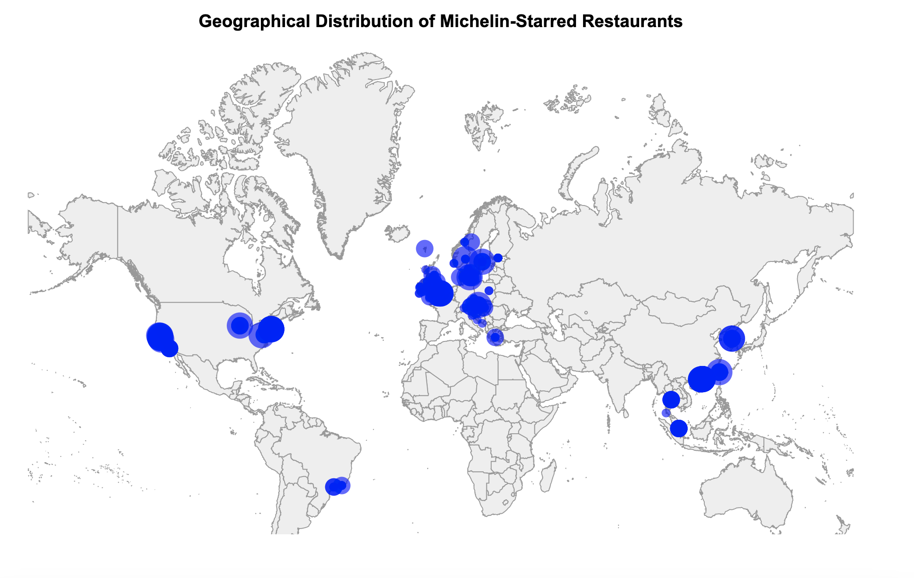
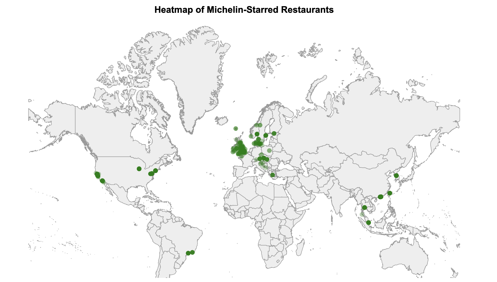
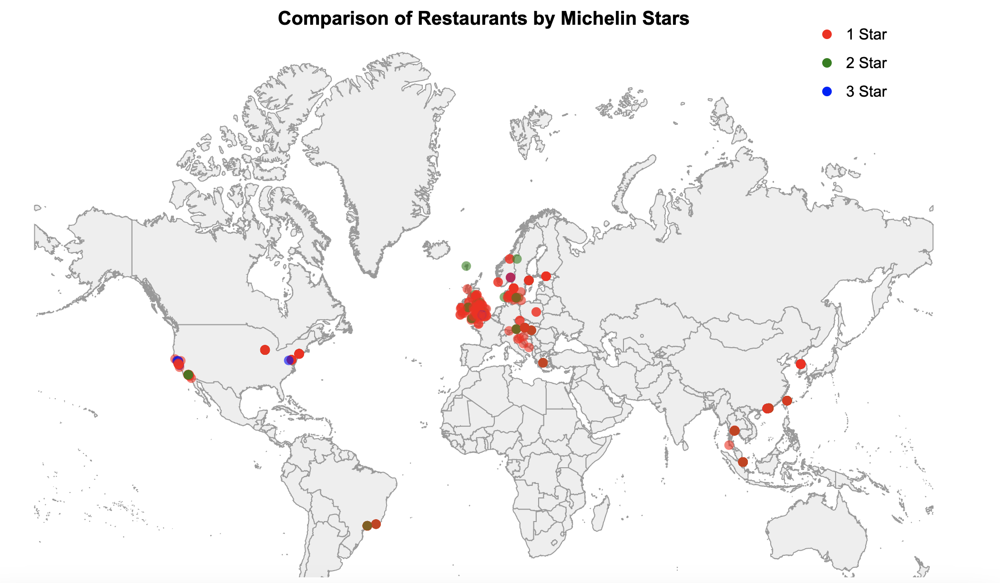
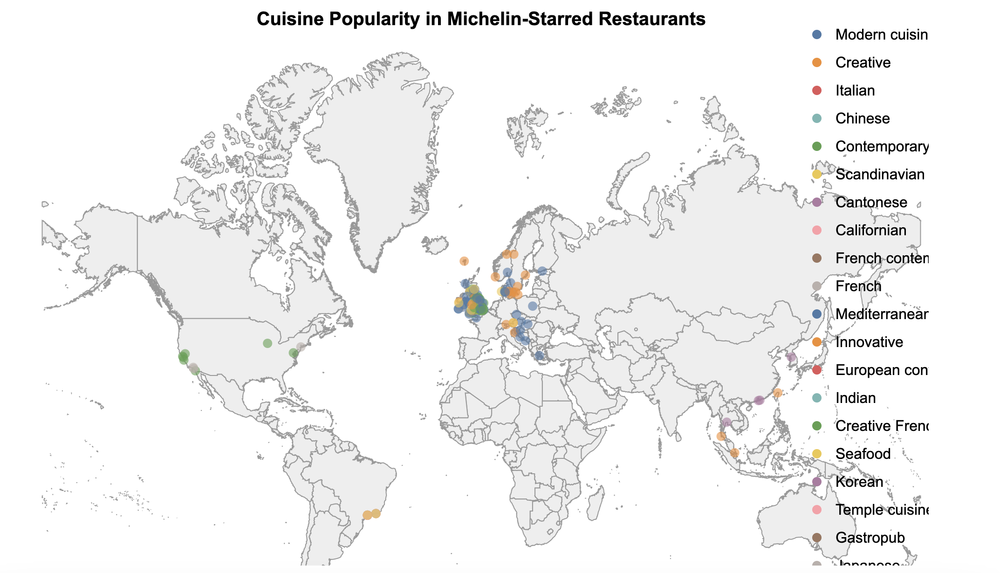

PART 1 
Complete EDA with Michelin star restaurants - https://colab.research.google.com/drive/1xNj50-WOcjwqZMUzqiEsztuBlz64hB1x?usp=sharing

What is EDA?

Exploratory Data Analysis (EDA) is the initial step in your data analysis process. The primary objective of EDA is to analyze the data for distribution, trends, outliers, and anomalies to inform the modeling strategy and the hypotheses generation process. In simpler terms, EDA helps to understand the data better, which eventually aids in deriving meaningful insights.

Why is EDA Important?

Understanding Data: Through EDA, you can get a clearer picture of your dataset. You'll understand the structure, the main variables, and the relationships between them.
Identifying Anomalies: This step helps in spotting any outliers or errors in the data, ensuring that any subsequent analysis isn’t flawed by anomalies.
Feature Engineering: By understanding the data, you can determine which variables are influential, allowing you to create new features that can help in model performance.
Informing Model Selection: Once you have a grasp of your dataset's trends and peculiarities, you can make better decisions regarding which models might be the most appropriate to apply.

Steps in EDA:

Data Cleaning: Handle missing data, detect and remove outliers, and treat duplicate data.
Descriptive Statistics: Provides a summary of the main aspects of the data like mean, median, mode, standard deviation, etc.
Data Visualization: Use charts and graphs to visualize the distribution, trends, and patterns in the data.
Feature Engineering: Enhance data by creating new features from the existing ones.
Correlation Analysis: Understand the relationship between variables.
Data Segmentation and Grouping: Group data by different categories or classes.
Hypothesis Testing: Test the assumptions or hypotheses made about the data.

Visualization through D3js
I have used 4 maps and plotted them with geojson file by geenrating the path. I used the same dataset to plot restaurants with their latitude and longitude. Below is the description and screenshot of each map I have executed.
The entire webpage file was heavy in size so I have uploaded it to Google drive and you can access it through this link - https://drive.google.com/file/d/1OBUGXMgupD9OCTDyrw0XzvI-qgG8SNlE/view?usp=sharing

1. Geographical Distribution of Michelin-Starred Restaurants
Description:
This map displays the locations of Michelin-starred restaurants across the world. Each circle represents a restaurant, demonstrating the global reach and distribution of these prestigious establishments.

2. Heatmap of Michelin-Starred Restaurants
Description:
This heatmap illustrates the concentration of Michelin-starred restaurants in different regions. Darker shades indicate a higher density of restaurants, highlighting culinary hubs around the world.

3. Comparison Map: Stars vs. Price
Description:
This map offers a comparative view of Michelin stars against the price range of restaurants. Larger circles represent restaurants with higher prices, while the color intensity denotes the number of Michelin stars, offering insights into the correlation between prestige and price.

4. Cuisine Popularity Map
Description:
This map showcases the most popular cuisines in cities with Michelin-starred restaurants. Each city is colored based on its most prevalent cuisine, offering a gastronomic tour of favored culinary traditions worldwide.

PART 2

1. Pandas Profiling with Netflix movies dataset - https://colab.research.google.com/drive/1L9nNklcY1Adjyk3msGmzds8gkjgi-k7o?usp=sharing
2. Sweetviz with university ranking dataset - https://colab.research.google.com/drive/1Sch90M5CFn4XOGoFKH0eFZaJ4MTzfpU-?usp=sharing

PART 3

Link - https://colab.research.google.com/drive/1rOsqIl47uy0QD4DGBGExbo5GxBm9SFbo?usp=sharing